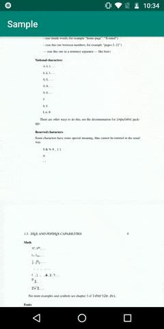
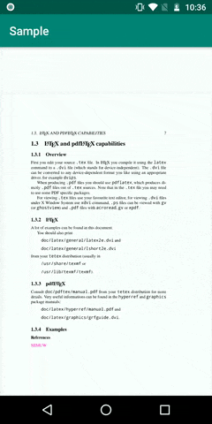

# Android PDFViewer
[  ](https://bintray.com/danjdt/maven/pdfviewer/_latestVersion)

A Android PDF Viewer that render pdf using `PdfRenderer` and displays it in a `RecyclerView`. The main goal was to render the pages only when necessary using `AsyncTask` to gain performance.

- Requires API Level 21

## Download
```groovy
implementation 'com.danjdt:pdfviewer:0.1.0'

```

## How to use

``` kotlin
    PdfViewer.Builder(rootView)
      .build()
      .load(file)
```
### All available options:
``` kotlin
    PdfViewer.Builder(rootView)
      .view(view)
      .quality(PdfPageQuality)
      .setZoomEnabled(true)
      .setMaxZoom(3f) //zoom multiplier
      .setOnPageChangedListener(onPageChangedListener)
      .setOnErrorListener(onErrorListener)
      .build()
      .load(file)
```

### File load options 
``` kotlin
    pdfViewer.load(file : File)
    pdfViewer.load(url : String)
    pdfViewer.load(@RawRes resId : Int)
    pdfViewer.load(inputStream : InputStream)
```

|     Scroll    |     Zoom      |
| ------------- | ------------- |
|  |  |


## Customize
- You can customize your view creating any view that implements `PdfViewInterface` and setting it into the `PdfViewer`

- You can customize the adapter overriding the `PdfPageViewAdapter` and `PdfPageViewHolder` and setting it as you adapter in the `PdfViewerRecyclerView` or any recycler view that implements `PdfViewInterface`

### Example
``` kotlin 
    class MyCustomPdfPageAdapter(private val context: Context) :
        PdfPageAdapter<DefaultPdfPageViewHolder>() {

        override fun onCreateViewHolder(parent: ViewGroup, viewType: Int): DefaultPdfPageViewHolder {
            val inflater = LayoutInflater.from(context)
            val view = inflater.inflate(R.layout.pdf_page, parent, false)
            return DefaultPdfPageViewHolder(view, pdfRenderer, pageSize)
        }

        override fun onBindViewHolder(holder: DefaultPdfPageViewHolder, position: Int) {
            holder.bind(position)
        }
    }
```
and
``` kotlin 
    class MyCustomPdfPageViewHolder(view: View, pdfRenderer: PdfRendererInterface, pageSize: Size?) :
    PdfPageViewHolder(view, pdfRenderer, pageSize) {

        private val image: ImageView = itemView.findViewById(R.id.image)

        override fun displayPage(bitmap: Bitmap, position: Int) {
            image.setImageBitmap(bitmap)
        }

        override fun resizePage() {
            pageSize?.let {pageSize ->
                image.layoutParams.width = pageSize.width
                image.layoutParams.height = pageSize.height
            }
        }

        override fun getPage(position: Int) {
            pdfRenderer.get(this, pagePosition)
        }

        override fun displayPlaceHolder() {
            {...}
        }
    }
    
```
then

``` kotlin
    val pdfRecyclerView = PdfViewerRecyclerView(context)
    pdfRecylerView.adapter = MyCustomPdfPageAdapter(context)
    
    PdfViewer.Builder(rootView).view(pdfRecyclerView).build().load(file)
```
